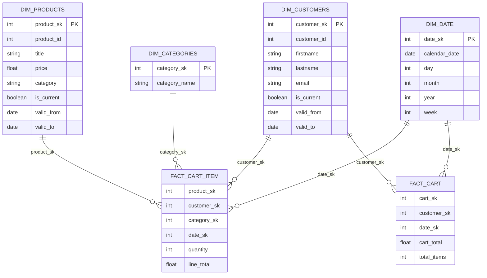

# End-to-End Data Warehouse Pipeline with SCD Type 2, ETL Staging, and Star Schema Modeling  
### Python • PostgreSQL • Staging • Data Warehouse • Star Schema • SCD Type-2

A complete end-to-end **data engineering pipeline** that extracts ecommerce data from a public API, stages it in PostgreSQL, and builds a production-grade **data warehouse** with a **star schema** and **Slowly Changing Dimensions (SCD Type-2)**.

---

## 🚀 Project Overview

### **1. Extract**
Fetch raw data from the FakeStore API:
- `/products`
- `/users`
- `/carts`
- `/categories`

### **2. Transform**
Using `pandas`:
- Normalize nested JSON  
- Flatten cart → product lines  
- Standardize columns & datatypes  
- Prepare relational dataframes  

### **3. Load to Staging (PostgreSQL)**
Staging tables:

| Table | Description |
|-------|-------------|
| `staging.stg_products` | Raw product data |
| `staging.stg_users` | Cleaned user data |
| `staging.stg_carts` | Flattened cart items |
| `staging.stg_categories` | Product categories |

All staging tables are **truncated before every run**.

### **4. Load to Data Warehouse (DW)**  
Warehouse is populated using stored procedures.  
Your DW schema includes:

### ✅ **Dimensions**
- `dw.dim_products`
- `dw.dim_customers`
- `dw.dim_categories`
- `dw.dim_date`

### ✅ **Facts**
- `dw.fact_cart_item` (one row per product inside a cart)
- `dw.fact_cart` (one row per cart/checkout)

Both fact tables join back to the four dimensions using surrogate keys generated in the DW layer.

### **5. SCD Logic**
`dim_products` and `dim_customers` implement **SCD Type-2**, tracking attribute history over time.

---

# 🏗️ ER Diagram — Full System (API → Staging → DW)

```mermaid
flowchart LR
    A[FakeStore API
Products, Users, Carts, Categories] --> B[Python ETL
Extract → Transform → Load]

    subgraph STAGING [PostgreSQL - Staging]
        S1[stg_products]
        S2[stg_users]
        S3[stg_carts]
        S4[stg_categories]
    end

    B --> STAGING

    subgraph DW [PostgreSQL - Data Warehouse]
        D1[dim_products (SCD2)]
        D2[dim_customers (SCD2)]
        D3[dim_categories]
        D4[dim_date]
        F1[fact_cart_item]
        F2[fact_cart]
    end

    STAGING --> |Stored Procedures| DW

    D1 --> F1
    D2 --> F1
    D3 --> F1
    D4 --> F1

    D1 --> F2
    D2 --> F2
    D3 --> F2
    D4 --> F2
```

---

# 🌟 Star Schema Diagram — Data Warehouse



---

# 📂 Repository Structure

```
etl_project/
├─ main.py
├─ .env
├─ requirements.txt
│
├─ config/
│   ├─ config.py
│   └─ logging_config.py
│
├─ db/
│   ├─ db.py
│   └─ run_procedures.py
│
├─ sql/
│   └─ sql_defs.py
│
├─ etl/
│   ├─ extract.py
│   ├─ transform.py
│   └─ load.py
│
└─ etl_staging.log
```

---

# 🧩 Key Components

## Python ETL

### `extract.py`
Fetches data from FakeStore API.

### `transform.py`
- Normalizes JSON  
- Flattens cart items  
- Maps user fields to customer dimension structure  

### `load.py`
Loads staging tables using bulk insert via `execute_values`.

---

## Database Layer

### `db.py`
- PostgreSQL connections  
- Create schema/tables  
- Truncate staging  

### `run_procedures.py`
Executes DW stored procedures:

```python
PROCEDURE_SEQUENCE = [
    "sp_load_dim_products",
    "sp_load_dim_customers",
    "sp_load_dim_categories",
    "sp_load_dim_date",
    "sp_load_fact_cart",
    "sp_load_fact_cart_item"
]
```

---

# 🧱 Data Warehouse Design

## ⭐ Dimensions

| Dimension | Description | Type |
|-----------|-------------|------|
| `dim_products` | Product catalog | SCD Type-2 |
| `dim_customers` | Customer master data | SCD Type-2 |
| `dim_categories` | Category lookup | Type-1 |
| `dim_date` | Calendar dimension | Static |

## 📊 Fact Tables

| Fact Table | Grain | Description |
|------------|--------|-------------|
| `fact_cart_item` | One row per product in a cart | Detailed item-level sales |
| `fact_cart` | One row per cart | Cart-level summary |

---

# ▶️ Running the Pipeline

### 1. Install dependencies
```
pip install -r requirements.txt
```

### 2. Configure `.env`
```
PG_HOST=localhost
PG_DB=staging_ecommerce
PG_USER=postgres
PG_PASSWORD=your_password
```

### 3. Execute full pipeline
```
python main.py
```

---

# 📊 Logging

All logs stored in:

```
etl_staging.log
```

---

# 📫 Contact

**Oluwatosin Amosu Bolaji**  
Data Engineer • Business Intelligence Analyst 